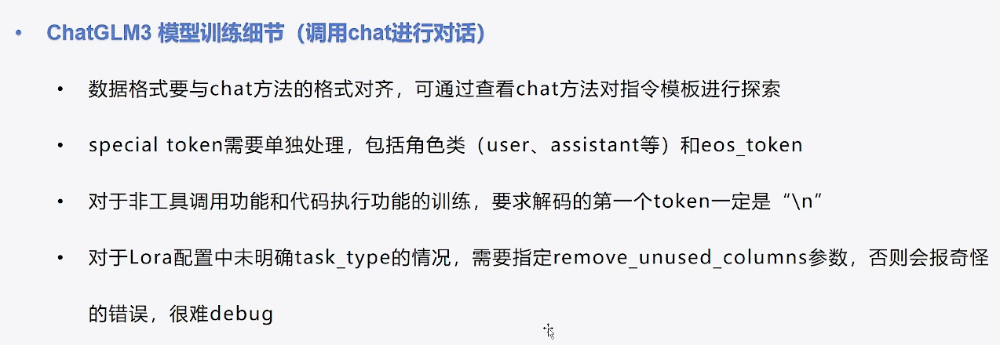

# LLM使用

先看完transformer和huggingface仓库的资料再看这个效果比较好。


## 计划微调：

Llama2：已完成

ChatGLM：已完成

NL2SQL


学习使用将个人数据集和LLM集成。


## 参考资料：

Extended Guide: Instruction-tune Llama 2：https://www.philschmid.de/instruction-tune-llama-2

Stanford Alpaca: An Instruction-following LLaMA Model：https://github.com/tatsu-lab/stanford_alpaca#data-release

Preparing Data for Fine-tunings of Large Language Models：https://heidloff.net/article/fine-tuning-instructions/

Llama Recipes: Examples to get started using the Llama models from Meta：https://github.com/meta-llama/llama-recipes

Llama2+LangChain外挂本地知识库详细教程：https://xtx0o8yn7x.feishu.cn/docx/UOAadjjReoI6UBxPq4lcI9frnMb


## 半精度微调Llama2注意点：

1、LlaMA2模型分词器的padding side要设置为right，否则可能不收敛

```
tokenizer.padding_side='right' # 一定要设置padding_side为right，否则batch大于1时可能不收敛
```

2、LlaMA2模型的分词器词表的问题，要适当调整数据的最大长度，保证数据内容的完整性：

```
llama的tokenizer词表很小，中文无法被单个token标识，一个中文字符会被标记为多个token，原文本就扩大了几倍，所以要扩大max_length。
```

3、LlaMA2模型加载时，需要指定torch dtype为半精度，否则模型将按照fp32进行加载

```
model.half() # 开启半精度
model.enable_input_require_grads()
```

4、prepare_model_for_kbit_training

```
# prepare model for training
model = prepare_model_for_kbit_training(model)
model = get_peft_model(model, config)
```

5、当启用gradient checkpoint训练时，需要一并调用model.enable input require grads()方法

6、当完全采用fp16半精度进行训练且采用adam优化器时，需要调整优化器中的adam epsilon的值，否则模型无法收敛

```python
args = TrainingArguments(
    output_dir="./my-llama2",
    per_device_train_batch_size=2,
    gradient_accumulation_steps=8,
    logging_steps=10,
    num_train_epochs=1,
    save_steps=20,
    gradient_checkpointing=True, # 需要model.enable_input_require_grads()
    adam_epsilon=1e-4 # 和半精度舍入有关
)
```

7、LIaMA2模型分词器会将非单独存在的eos token切开，因此对于eos_token要单独处理，否则训练后的模型在预测时不知道何时停止


8、半精度训练时，正确加入eos_token后，要将pad_token_id也置为eos_token_id，否则模型通用无法收敛（因为出现溢出）

```
# tokenizer.pad_token = tokenizer.eos_token
tokenizer.pad_token_id = 2
```


## ChatGLM使用要点：

1、调用chat方法

```
model.chat(tokenizer, "python代码使用if-else", history=[])
```

2、**tokenizer.get_command**

只有通过get_command才能获得真正special token的token id。

special token：\<user> 、 \<role>

所以，要获得token_id:

- special token: tokenizer.get_command(f"<|{role}|>")

- 普通文本： tokenizer.encode(message)


3、**训练数据格式：**


```python
def process_func(example):
    MAX_LENGTH = 256
    input_ids, attention_mask, labels = [], [], []

    # query
    instruction = "\n".join([example["instruction"], example["input"]]).strip()     

    # tokenizer.build_chat_input
    # 就会构造出：[gMASK]sop<|user|> \n query<|assistant|>
    instruction = tokenizer.build_chat_input(instruction, history=[], role="user")  

    # response前面一定加\n
    # 加add_special_tokens=False是避免在response部分加上[gMASK]sop
    response = tokenizer("\n" + example["output"], add_special_tokens=False)        # \n response, 缺少eos token

    # 组装
    # 因为build_chat_inpu的input_ids是一个tensor，所以要变成list
    input_ids = instruction["input_ids"][0].numpy().tolist() + response["input_ids"] + [tokenizer.eos_token_id]
    attention_mask = instruction["attention_mask"][0].numpy().tolist() + response["attention_mask"] + [1] # 多一位
    labels = [-100] * len(instruction["input_ids"][0].numpy().tolist()) + response["input_ids"] + [tokenizer.eos_token_id]
    if len(input_ids) > MAX_LENGTH:
        input_ids = input_ids[:MAX_LENGTH]
        attention_mask = attention_mask[:MAX_LENGTH]
        labels = labels[:MAX_LENGTH]
    return {
        "input_ids": input_ids,
        "attention_mask": attention_mask,
        "labels": labels
    }
```

4、训练细节



